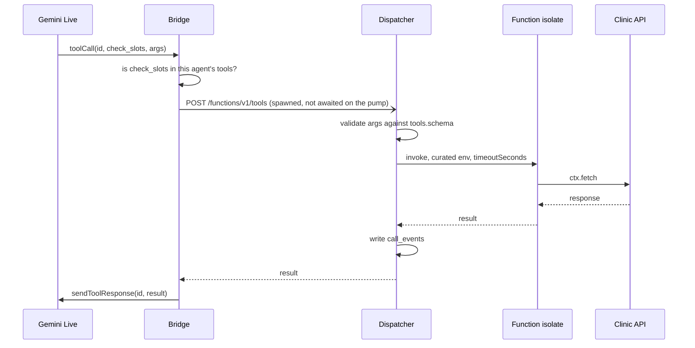

# The functions SDK

**Status:** built.
**Supersedes:** the authoring half of `2026-08-31-tool-dispatcher.md`. That spec
described how a tool is *invoked* and left where a tool *comes from* unanswered —
the four existing tools were hand-inserted rows pointing at `vayuveda.example`.
**Written by the implementer**, which means it bends toward what is easy to
build. An independent read of the "Open" section is worth more than agreement.

## The problem

An agent can be told about a tool and can call one. It cannot be given one.

Everything downstream of the `tools` table works and is proven on a live call:

```
compose_agent_tools(agent_id)          migration 0029
  -> graph.rs:402  agent_tools()
  -> vokoo_bridge.rs:941  declared = [finish_call] + tools
  -> Gemini SetupConfig.tools
  -> ServerEvent::ToolCall { id, name, args }
  -> mod.rs:465  call_live()
  -> the dispatcher
```

What is missing sits entirely upstream of `tools`. There is no way to write a
function, no way to run one before an agent depends on it, and no credential a
command-line tool could authenticate with. The four rows in `tools` were typed
into psql and point at a hostname that does not resolve.

So this spec covers authoring, packaging, shipping and running — and changes
nothing about how a tool is declared or invoked.

## What exists today

Verified on 1 September 2026 against the running system, not recalled.

| | |
| --- | --- |
| `api_keys` table | **exists**, correct shape, **0 rows**, and `server/src/main.rs` never mentions it |
| Control-plane auth | every endpoint calls `user_client(bearer)` and forwards a Supabase **user JWT** to PostgREST, so RLS enforces `is_org_member` |
| Edge runtime | `supabase-edge-functions` on the VPS, functions bind-mounted from `/opt/supabase/supabase/docker/volumes/functions` |
| Isolation | `main/index.ts` calls `EdgeRuntime.userWorkers.create({ servicePath, memoryLimitMb, workerTimeoutMs, envVars })` — one isolate per function |
| `tools` columns | `id, org_id, name, kind, description, endpoint_url, schema, config` |
| `tools` rows | 4, all `kind='http'`, all pointing at `https://vayuveda.example/…` |

Two probe results decide design choices below, both measured rather than assumed:

- A function isolate **holds `SUPABASE_SERVICE_ROLE_KEY`** and cannot drop it:
  `Deno.env.delete` throws `NotSupported`. Every function deployed there today
  can read every table in every organisation.
- `userWorkers.create` takes `envVars` as an **explicit list**. `main/index.ts`
  currently passes `{...Deno.env.toObject()}`, which is a choice, not a
  constraint.

The second fact is what makes the first fixable, and it only becomes fixable
once deployment is owned by a program rather than by a person with `scp`.

## The concept

You write functions in a repository. A CLI bundles them and pushes them to your
workspace. A function marked as a tool becomes callable by any agent whose
skills grant it.

```bash
vokoo login                # exchanges an API key for a stored profile
vokoo init                 # scaffolds a functions project
vokoo new check_slots      # scaffolds one function
vokoo dev                  # watch, bundle, push on save
vokoo push                 # one-off
vokoo run check_slots -p '{"doctor":"Rao","date":"2026-09-02"}'
vokoo logs check_slots
```

`run` is the part that answers "how do I try this before an agent depends on
it". It executes on the server, through the same path a caller reaches, and
prints the result and the logs. A test that runs somewhere else proves something
about somewhere else.

## Authoring

One file per function. The declaration and the code live together, because a
description that drifts from its handler is a model being told something untrue.

```ts
import { defineTool } from "@vokoo/sdk"

export default defineTool({
  // Authored, not assigned. See "Identity" below.
  id: "c9f84c8d-0bdc-4d8a-a393-6f0d1c75bdcf",
  name: "check_slots",
  description: "Find open appointment slots for a doctor on a date.",
  input: {
    doctor: { type: "string", required: true, description: "Surname, as the caller said it." },
    date:   { type: "string", required: true, description: "ISO date." },
  },
  timeoutSeconds: 10,
  async handler({ doctor, date }, ctx) {
    const r = await ctx.fetch(`https://clinic.vayuveda.in/slots?doctor=${doctor}&date=${date}`)
    return { slots: (await r.json()).available }
  },
})
```

`description` is what the model reads when deciding whether to call this. It is
prompt text, and it should be written as such.

`input` compiles to a JSON Schema stored in `tools.schema`. That column is
already passed to Gemini as `parameters` unchanged (`vokoo_bridge.rs:132`) and
is already what the dispatcher validates against. One declaration, three
readers — the model, the validator and the composer's config form. Where they
diverge, a model calls a tool with arguments its executor rejects.

`ctx` carries the call it is running for: `ctx.callId`, `ctx.orgId`,
`ctx.variables` (the flow's `var` nodes), and `ctx.fetch`. See "What a handler
may reach".

### Identity

`id` is a UUID written in the source and never assigned by the server.

Without it, sync has to match on name, and renaming a function looks like
deleting one and creating another — which orphans every `call_events` row that
referenced it and silently detaches the tool from the skills it was linked to.
With it, a rename is an `UPDATE`.

`vokoo new` generates the UUID so nobody types one. This is the one piece of
ceremony in the format and it earns its place.

### Identity is not versioning, and it is what makes versioning possible

`id` names the function. A **version** names one build of it. `(id, version)`
is the key, and the shape is already in this schema:

```
flow_versions: flow_id, version int, snapshot jsonb, published_by, created_at
               unique (flow_id, version)  ->  restore_flow_version(p_flow_id, p_version)
```

`tool_versions` follows it exactly: `tool_id`, monotonic `version`, `checksum`,
`bundle`, the manifest entry as `snapshot`, `published_by`. `tools` holds the
pointer to the current version. Restoring is repointing, as it already is for a
flow. Nothing here is new; a second pattern for the same problem would be.

**Every version is kept.** A bundle is tens of kilobytes, and a checksum in a
call trace that points at something no longer retrievable makes the trace a
claim nobody can check. Pruning is a problem to solve when storage says so.

### What a call pins, and when

Two things resolve at different moments, and this is where versioning actually
bites:

- The **declaration** — name, description, schema — is sent to Gemini in
  `SetupConfig.tools` at session setup, second zero.
- The **bundle** would otherwise be resolved at invocation, ninety seconds later.

Push between those two moments and the model calls a tool it was declared with
schema v3, while the executor runs bundle v4 whose schema is v5. That is the
drift this spec warns about under "Authoring", arriving through a door the
declaration path cannot see.

**So the version is pinned at session setup**, where the declaration list is
built. `compose_agent_tools` returns `version` beside `schema`;
`vokoo_bridge.rs:941` keeps it; the dispatch carries it; the dispatcher runs
that version and no other. One call runs one version of each tool from first
word to last — the same property the compiled-flow work wants for the graph.

Work deferred past the caller keeps the version it started with. A background
task finishing after the call ended is still that call's work.

### The cost of client-authored identity

An id chosen by the client rather than assigned by the server introduces two
failures that server-assigned ids cannot have. Both are the build's or the
receiver's job to refuse:

1. **The same id twice in one repository.** Copy-paste. The build rejects it
   before anything is pushed.
2. **An id that already exists under a different organisation.** The upsert is
   keyed on `(org_id, id)` and **refuses** when the id is present under another
   org — it does not fall through to an insert. UUID collision by accident is
   negligible; this rule is not about accident. Without it, anyone who learns an
   id can overwrite another workspace's tool by writing that id in their own
   source.

## The manifest

`vokoo push` sends a manifest, not files. Each entry:

```jsonc
{
  "id":            "c9f84c8d-…",
  "name":          "check_slots",
  "description":   "Find open appointment slots…",
  "schema":        { "type": "object", "required": ["doctor","date"], "properties": { … } },
  "timeoutSeconds": 10,
  "isTool":        true,
  "checksum":      "sha256:…",   // of the bundle
  "bundle":        "…"           // the built JS, base64
}
```

`checksum` is what makes a push cheap: the server skips any entry whose checksum
matches what it already holds, so `vokoo dev` on save re-uploads only what
changed. It is also what a call trace can name — "this call ran `check_slots`
at `sha256:ab12…`" is answerable, and "this call ran `check_slots`" is not.

**Deletion is explicit.** A function absent from the manifest is *not* removed:
a partial push from a broken build would otherwise delete live tools. Removal is
`vokoo rm <name>`, which is a separate verb because it is a separate intention.

## Keys

The table is already right. What is missing is the two ends.

**Built.** Migration `0032_api_key_machine_users.sql`, and the control plane.

RLS asks which *person* is calling — `is_org_member` joins `memberships` on
`auth.uid()` — and a key belongs to an organisation. There is no `auth.uid()`
for an org, so an earlier draft of this section described something that does
not run. A key therefore acts as a **machine user**: a row in `auth.users`, a
`memberships` row with role `developer`, created idempotently by
`machine_user_for_org(org_id)`. RLS is untouched and the key is a principal that
can be listed, audited and revoked like any other member.

`developer` rather than `owner` or `admin` is load-bearing. Migration 0032 also
splits the `api_keys` policy: reading stays open to members, writing now
requires `is_org_admin`. The shipped policy allowed any member to write, which —
once a machine user is itself a member — let a leaked key mint its own
replacement and outlive being revoked.

**Minting.** `POST /api/v1/api-keys { name, expires_at? }` generates
`vk_live_` + 43 characters from an alphabet with no look-alikes, since these get
copied out of terminals by hand. Stores `prefix` (first 11 characters, indexed,
not secret) and `key_hash`, returns the secret **once**, and never returns the
hash.

**Hashing is SHA-256, not a KDF.** The spec first said argon2id. A key is 32
bytes of entropy, so there is no dictionary to attack and a slow KDF would buy
nothing while adding its cost to every request. This is the same reasoning that
puts a fast hash behind most API-key schemes and argon2 behind passwords.

**Presenting.** `Authorization: Bearer vk_live_…` is accepted anywhere a session
is. `authed_client` is the single entry point — 22 handlers were converted to it
— so a key works everywhere a browser does without 22 chances to forget one.

Resolution runs through `resolve_api_key`, a `security definer` function
reachable with the anon key. That is the decision worth arguing about: the
alternative is giving the control plane the service role key so it can read
`api_keys` past RLS, and a process holding that key can read every table in
every organisation. This one can ask a single question and gets back only the
principal to act as. Unknown, revoked and expired keys are all answered
identically — saying which would tell someone probing that they had found a real
prefix.

The control plane then signs a 5-minute JWT with `SUPABASE_JWT_SECRET` and
`sub` set to the machine user, and proceeds as for a logged-in user. It uses
`token_client`, which sets the Authorization header but skips `set_auth` —
`set_auth` round-trips to GoTrue to validate a session, and there is no session
here.

`scopes` exists on the table and stays unused in the first version. A column
with one value in it is cheaper than a migration later.

## What a handler may reach

A handler runs inside the `run` function, in a Deno isolate that `main/index.ts`
creates with an **empty environment** — `SUPABASE_FUNCTION_SLUG` and nothing
else. There is no per-tool function on disk: a tool is a row, and `run` imports
it. So the curation is one slug rather than a prefix.

This is an edit to a file Supabase ships and an upgrade will replace it. It is
recorded in `docs/vendor-overrides.md`, in CLAUDE.md, and as a repo copy at
`supabase/functions/main/index.ts`.

`ctx.fetch` is a wrapper rather than the global, so an outbound call is
attributable in the logs and can later be given an allowlist without changing
any handler. `fetch` itself stays available; taking it away while
`ctx.fetch` exists would be theatre.

Secrets reach a handler as `ctx.secrets.<name>`, resolved per invocation from
`vendor_credentials` — never baked into a bundle. A bundle is copied, cached and
logged; a credential inside one leaks everywhere the bundle goes.

## Execution



`vokoo run` enters at the dispatcher with a synthetic `call_id`, so it exercises
validation, the isolate, the curated environment and the trace — everything
except Gemini.

## What this does not change

- `compose_agent_tools`, the declaration builder, and the Gemini client. All
  proven; none touched.
- `kind='http'`. A tool that is a remote service someone else operates keeps a
  URL and keeps working. The SDK adds `kind='function'` beside it.
- The dispatcher's contract. `2026-08-31-tool-dispatcher.md` still describes the
  request and response.

## In the console

`/tools` lists the workspace's tools, pushed and hand-made alike, separated by
`Kind` and `Version` — a hand-made tool has no version and shows a dash. A row
opens `/tools/{id}`: the source with line numbers, a version selector, and a
panel that runs the tool with arguments prefilled from its schema, reporting
what it printed, what it returned and how long it took.

**The source is shown and not edited.** A pushed tool's authority is a
repository; editing it here would make the console a second author, and the next
`vokoo push` would overwrite what was typed without saying so.

## Adopting a tool that already exists

The four seeded `kind='http'` rows were inserted by hand and have server-assigned
ids. Pushing a tool that reuses one of their names is refused by the new unique
index, which is right — but it means the SDK cannot take over a tool somebody
made in the console without deleting it first. A `vokoo pull` that writes a stub
carrying the existing id would close this, and nothing in the design prevents it.

## Open

- **The dispatcher's live budget returns `ok: true` on a timeout**, which tells
  the model a tool succeeded when it has not. The spec's own table says
  `ok:false, error:"timed_out"` and the prose below it says otherwise; the code
  followed the prose. Not caused by this work, and made more visible by it.
- **`ServerEvent::ToolCallCancellation` is unhandled.** Gemini cancels a tool
  call when the caller interrupts. The side effect still runs — an appointment
  booked for a turn the model abandoned. This matters more once tools do real
  work.
- **Nothing enforces that a tool the model calls is one the agent's skills
  granted.** `call_live` sends no `agent_id`, so the dispatcher cannot check
  even if it wanted to. Named as open in the dispatcher spec and still open.
- **Multi-file tools.** A tool is one file today. Bundling is the growth path
  and needs no change to the manifest, which already carries a checksum over
  whatever was shipped.
- **`npm:` specifiers on the executor.** Deno resolves them and the Supabase
  runtime is Deno 2.1.4, so this should hold. Not yet exercised end to end.
- **Which version `vokoo run` executes.** The current one is the useful default,
  but reproducing a past call means running the version that call pinned, so
  `run` needs `--version` before a support conversation needs it.
- **Local execution.** `vokoo run` is server-side. Running a handler on the
  developer's machine needs `ctx` stubbed, which is a second implementation of
  the context and a second thing to keep true.

## Order

1. ~~**Key minting**~~ — **done**. Migration 0032 applied and proven in SQL;
   the control plane builds. Not yet deployed, and `SUPABASE_JWT_SECRET` must be
   added to `/opt/vokoo/controlplane/server/.env` before it will start.
2. ~~**`@vokoo/sdk`**~~ — **done**. `packages/sdk`: `defineTool`, `compileSchema`,
   `manifestEntry`, `assertPushable`. 23 tests, no dependencies and no build
   step — Node 22 strips the types.
3. ~~**`vokoo` CLI**~~ — **done**. `packages/cli`, no dependencies:
   `login` (key on stdin or a prompt, verified before it is stored), `logout`,
   `whoami`, `init`, `new`, `push`, `dev`. 20 tests.

   **No bundler.** The executor is a Deno isolate, which compiles TypeScript and
   resolves `npm:` specifiers itself, so a tool ships as the source you wrote.
   The cost is that a tool is one file: `checkSource` refuses a sibling import
   with a message naming the alternative, rather than pushing something whose
   import fails on the other side. This is the answer to the "TypeScript
   targets" question left open below — there is no build target to choose.
4. ~~**The receiver**~~ — **done**. Migration 0034 and
   `POST /api/v1/functions`. `push_functions` does the whole push in one
   transaction, as the API key's machine user, so row-level security decides
   what may be written.

   **The source lives in `tool_versions`, not on the edge runtime's
   filesystem.** Writing files would have the control plane reaching into a
   directory owned by the Supabase container, and would make a rollback a
   matter of moving files rather than repointing a row.

   Also here, because it was missing and the dispatcher depends on it:
   `tools` now has a unique index on `(org_id, name)`. The dispatcher resolves
   a tool by name with `limit 1`, and nothing stopped two rows sharing one —
   which made *which* tool ran a matter of row order.
5. ~~**`run` and `logs`**~~ — **done**. `supabase/functions/run` is the
   executor; `POST /api/v1/functions/{name}/run` reads the version through RLS
   and sends the code to it.

   **The executor holds no database client.** Code and context arrive in the
   request, so the one function that evaluates other people's code cannot reach
   anything on its own behalf — which matters because every isolate here carries
   the service role key and cannot drop it. It authenticates on
   `VOKOO_RUN_SECRET`, shared with the control plane and deliberately not the
   service key.

   **Types are stripped by the CLI, not the executor.** Measured: a Deno isolate
   imports JavaScript from a `data:` URL, refuses TypeScript from one, and
   refuses a `.ts` file written to `/tmp` because a worker's module loader is
   scoped to its own function. `module.stripTypeScriptTypes` is in Node, so this
   still needs no bundler, and it blanks types in place — a stack trace from a
   running tool points at the line you wrote.

   `logs` reads `call_events`, where the dispatcher already records a tool call
   in order beside the flow steps around it.
6. ~~**The curated `envVars` patch to `main/index.ts`**~~ — **done**, and
   recorded in `docs/vendor-overrides.md`.

   The vulnerability was measured before it was fixed. A pushed tool whose whole
   body was `Deno.env.toObject()` read **fifteen** variables, including
   `SUPABASE_SERVICE_ROLE_KEY`, `SUPABASE_DB_URL` and `JWT_SECRET` — so any tool
   anyone pushed owned the database. Afterwards it reads two, neither of them a
   credential.

   The authentication for `run` moved into `main` as part of this: once the
   worker's environment is empty there is no secret left inside it to compare
   against, and nothing can reach the worker except through main.

Steps 1–3 are provable with `curl` and a unit test. Step 4 is the first one that
needs the VPS. Step 6 is the one that a Supabase upgrade can silently undo, so it
comes last and gets written down twice — in `docs/vendor-overrides.md` and in
CLAUDE.md.
